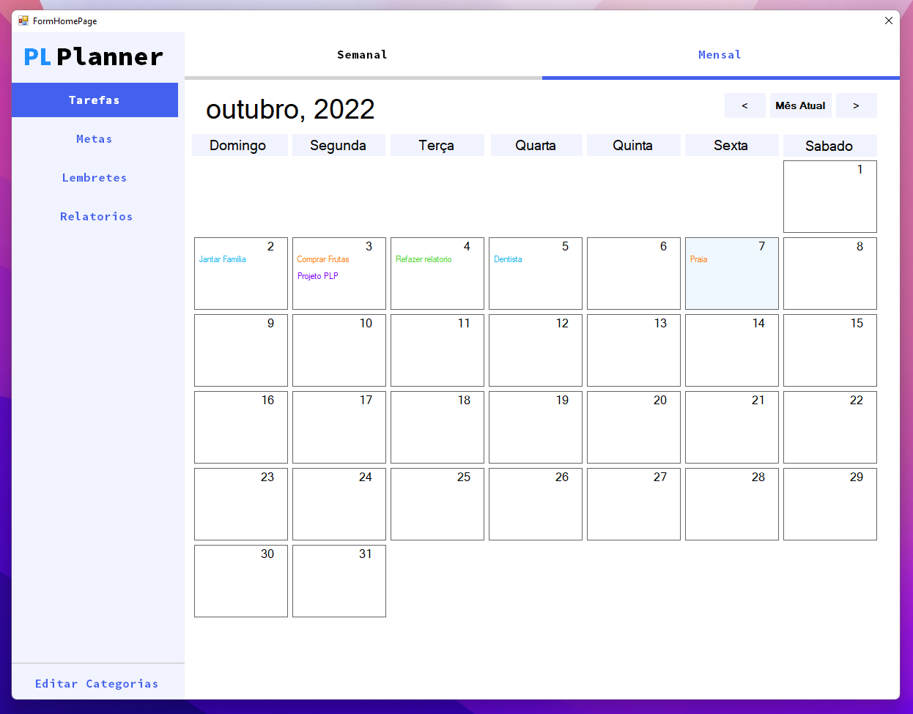
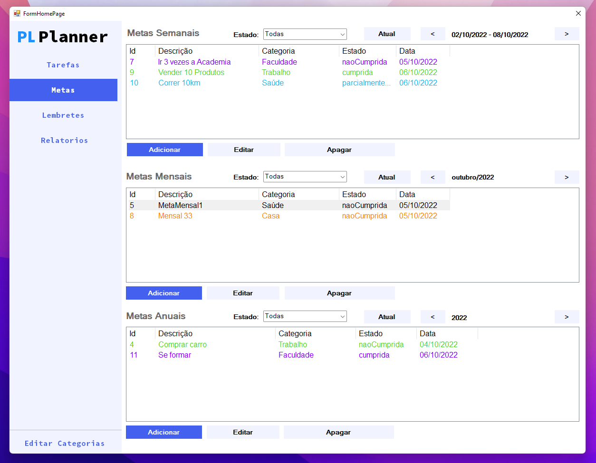
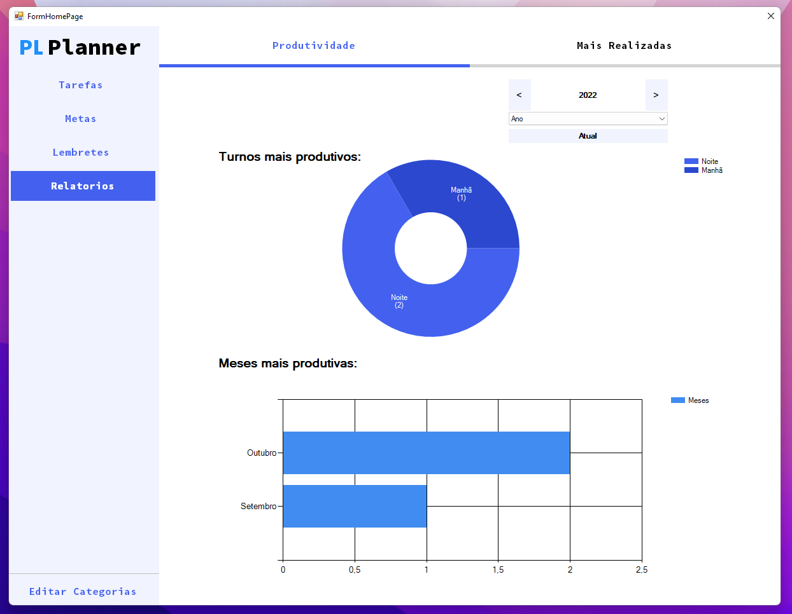
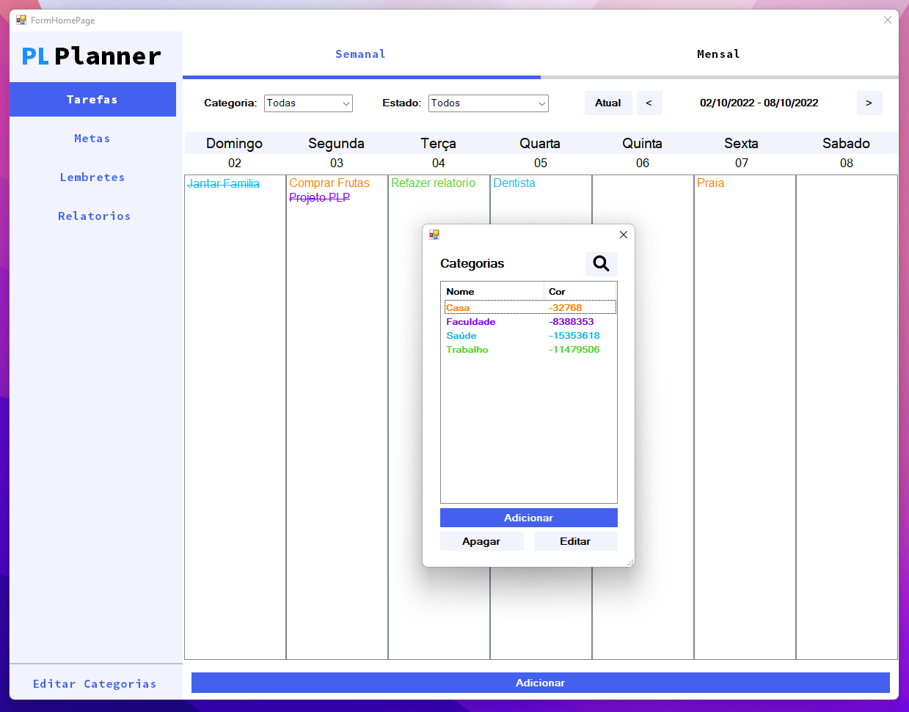

## PlannerVirtual

Projeto da disciplina de Paradigmas de Linguagens de Programação

# :octocat: Integrantes
[José Daniel](https://github.com/JoseDanielF) | [Alex Silva](https://github.com/alexlsilva7) | [Arthur Costa](https://github.com/arthur007110) | [Antonio Bezerra](https://github.com/antoniobezerra01)

[Seminário da disciplina - VB.NET](https://docs.google.com/presentation/d/1mX0Z8jHYbHwVVwIjJqaigPR8WRa3fG769xTW_1oKz04/edit?pli=1#slide=id.gc6f980f91_0_0)

#Imagens do sistema

